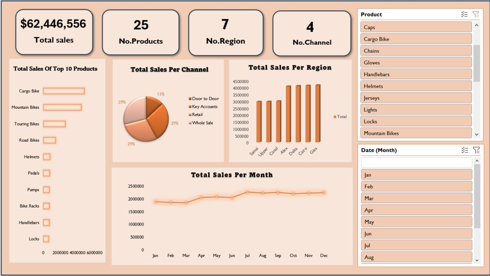

# Comprehensive Sales Analysis & Dashboard

## Project Overview

This project showcases the power of **Microsoft Excel** as a robust Business Intelligence tool. I created an interactive dashboard that provides a comprehensive view of sales performance by cleaning, modeling, and visualizing a large dataset. The primary objective was to turn raw data into a dynamic and actionable tool for data-driven decision-making.

## Technical Methodology

I followed a structured data analysis workflow to ensure the integrity and effectiveness of the final dashboard:

* **Data Cleaning & Transformation**: Utilized **Power Query** to clean and prepare the raw data, handling inconsistencies and optimizing it for analysis.
* **Data Modeling**: Built a relational **Data Model** to link multiple tables (Facts & Dimensions) and ensure data accuracy.
* **Star Schema**: Implemented a **Star Schema** to design a structured and efficient model, which simplifies data querying and enhances performance.
* **Visualization**: Created an interactive dashboard using a combination of **PivotTables**, **Pivot Charts**, and **Slicers** to allow for dynamic filtering and exploration of key insights.

## Key Insights from the Dashboard

The analysis helped me uncover critical business insights and performance indicators:

* **Total Sales Exceeded $62M**: The dashboard highlights the impressive overall sales performance.
* **Product Performance**: Only three product categories account for the majority of total sales, revealing a concentration of revenue drivers.
* **Sales Channel Analysis**: There is a balanced performance across the three main sales channels, while the "Door-to-Door" channel is identified as an area for improvement.
* **Geographical Dominance**: Four governorates—**Cairo**, **Giza**, **Delta**, and **Alexandria**—dominate the sales landscape, while other regions are relatively close in performance.
* **Seasonal Trends**: The dashboard clearly visualizes sales peaks in certain months, providing a key opportunity for future promotional and marketing campaigns.

## Dashboard Visualization

Below is a snapshot of the final interactive dashboard, demonstrating the project's visual output.

## Files Included

* **Lookup Tables.xlsx**: This file contains the dimension tables, providing descriptive data about products and other entities.
* **clean_data.xlsx**: The cleaned and prepared dataset used for the analysis, which has been organized and optimized for a star schema model.
* **Sales-Dashboard.jpg**: A visual representation of the final interactive dashboard, showcasing key insights.
* **Facts Data**: The main sales data (Facts) is too large for GitHub and can be found at this Google Drive link: [https://drive.google.com/file/d/1HOrKCQa-3Y-0GjX5f5QEpXb-0hJnYnnU/view?usp=drivesdk](https://drive.google.com/file/d/1HOrKCQa-3Y-0GjX5f5QEpXb-0hJnYnnU/view?usp=drivesdk).

This project demonstrates strong skills in the end-to-end data analysis process, from data cleaning and modeling to visualization and strategic insight generation.
